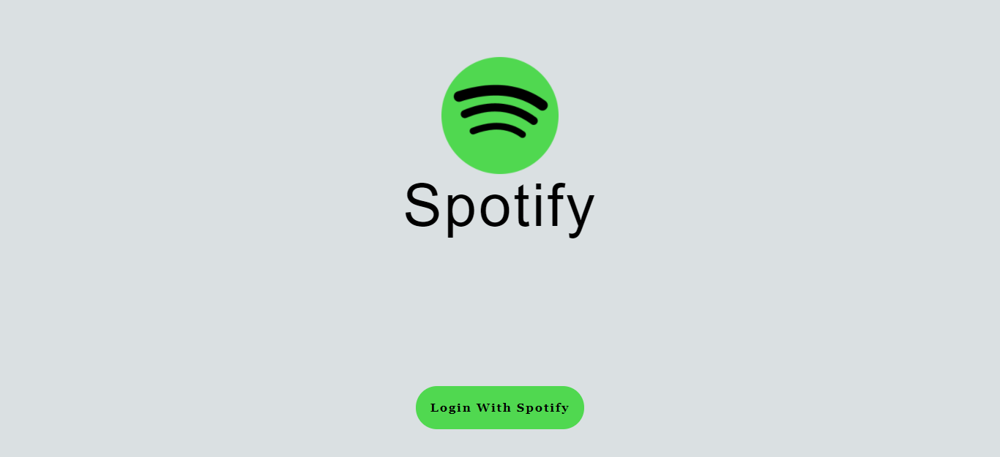
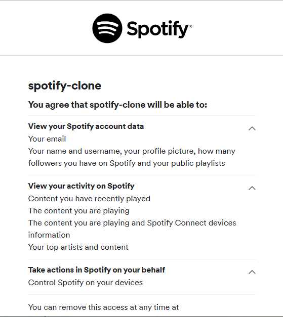
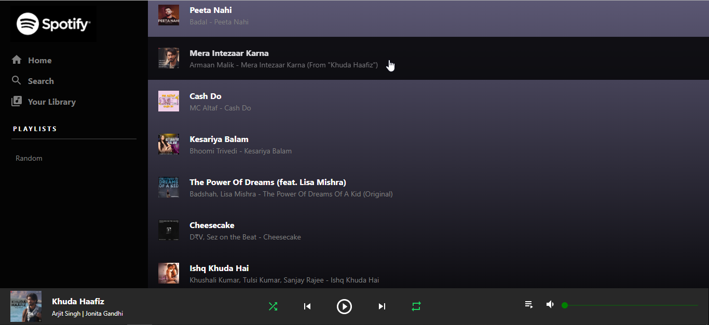
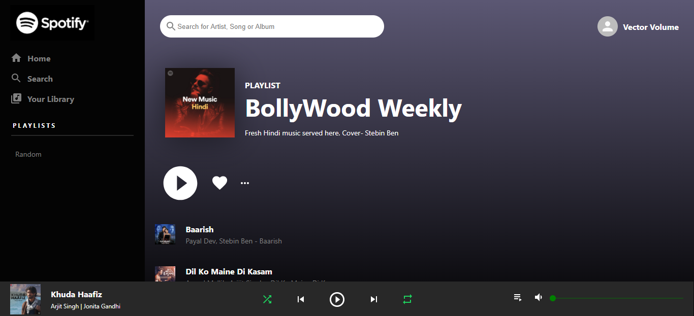

# Spotify Clone 

This is a Spotify reactJS web clone, which has an original Spotify login authentication. And fetches the user detail, playlist name, and Bollywood weekly playlist full details like songs name, artist name, cover image.

## Features : 

1. Spotify Authentic Login System

2. Spotify API for fetching data

:collision: :collision: :collision: :collision: :collision: :collision: :collision: :collision: :collision:

## What Have I Learnt ?

1. Material UI

2. Spotify API working

3. CSS (There is always something new in this :laughing: )

4. Revised Context API concept of ReactJS

:collision: :collision: :collision: :collision: :collision: :collision: :collision: :collision: :collision:

## Prerequisites

1. Installed NodeJS [Official Website](https://nodejs.org/en/)
2. Knowledge of ReactJS [Official Website](https://reactjs.org/)
3. Knowledge of MaterialUI [Official Website](https://material-ui.com/)

:collision: :collision: :collision: :collision: :collision: :collision: :collision: :collision: :collision:

## How to Run ?

1. Clone this github repo </br> ```git clone https://github.com/singhanuj620/spotifyClone.git ```
2. Install all the dependencies </br> ```npm install```
3. Make a file name **spotify.js** inside **/src**
4. Content of file will be : </br> 
```export const authEndpoint = 
"https://accounts.spotify.com/authorize";

const redirectUri = "http://localhost:3000/"

const clientId = <YOUR CLIENT ID>

const scopes = [
    "user-read-currently-playing",
    "user-read-recently-played",
    "user-read-playback-state",
    "user-top-read",
    "user-modify-playback-state",
    "user-read-email"
]

export const getTokenFromResponse = () => {
    return window.location.hash
    .substring(1)
    .split('&')
    .reduce( (initial, item) => {
        let parts = item.split('=');
        initial[parts[0]] = decodeURIComponent(parts[1])
        return initial
    }, {});
}

export const loginUrl = `${authEndpoint}?client_id=${clientId}&redirect_uri=${redirectUri}&scope=${scopes.join("%20")}&response_type=token&show_dialog=true`; 
```
4. Get your own spotify **client id** [From Here](https://developer.spotify.com/) and paste in the **spotify.js** file. _Line 6 approx_
5. In terminal run the application </br> ```npm start```

:collision: :collision: :collision: :collision: :collision: :collision: :collision: :collision: :collision:

:heart: :heart: :heart: :heart: :heart: :heart: :heart: :heart: :heart: :heart: :heart: :heart: :heart: :heart: :heart: :heart: 

## MY PERSONAL PORTFOLIO (Click Here)[https://anujportfolio.herokuapp.com]
## INSTAGRAM ACCOUNT (Click Here)[https://instagram.com/anujcodeop]
## LINKEDIN ACCOUNT (Click Here)[https://www.linkedin.com/in/anuj-singh-007/]

:heart: :heart: :heart: :heart: :heart: :heart: :heart: :heart: :heart: :heart: :heart: :heart: :heart: :heart: :heart: :heart: 

## ScreenShots : 









